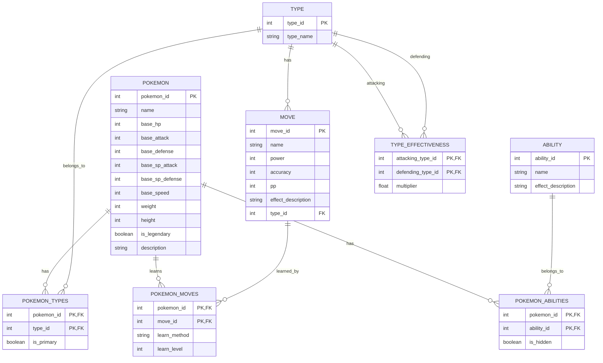

# Database Project HEAU
For ITU BLG317E Database Systems Course by **H**üseyin **E**rtuğrul **A**rif **U**tku

# Entity Relationship Diagram

```mermaid
erDiagram
    POKEMON {
        int pokemon_id PK
        string name
        int base_hp
        int base_attack
        int base_defense
        int base_sp_attack
        int base_sp_defense
        int base_speed
        int weight
        int height
        boolean is_legendary
        string description
    }

    TYPE {
        int type_id PK
        string type_name
    }

    POKEMON_TYPES {
        int pokemon_id PK, FK
        int type_id PK, FK
        boolean is_primary
    }

    MOVE {
        int move_id PK
        string name
        int power
        int accuracy
        int pp
        string effect_description
        int type_id FK
    }

    POKEMON_MOVES {
        int pokemon_id PK, FK
        int move_id PK, FK
        string learn_method
        int learn_level
    }

    ABILITY {
        int ability_id PK
        string name
        string effect_description
    }

    POKEMON_ABILITIES {
        int pokemon_id PK, FK
        int ability_id PK, FK
        boolean is_hidden
    }

    TYPE_EFFECTIVENESS {
        int attacking_type_id PK, FK
        int defending_type_id PK, FK
        float multiplier
    }

    POKEMON ||--o{ POKEMON_TYPES : "has"
    TYPE ||--o{ POKEMON_TYPES : "belongs_to"
    POKEMON ||--o{ POKEMON_MOVES : "learns"
    MOVE ||--o{ POKEMON_MOVES : "learned_by"
    POKEMON ||--o{ POKEMON_ABILITIES : "has"
    ABILITY ||--o{ POKEMON_ABILITIES : "belongs_to"
    TYPE ||--o{ TYPE_EFFECTIVENESS : "attacking"
    TYPE ||--o{ TYPE_EFFECTIVENESS : "defending"
    TYPE ||--o{ MOVE : "has"
```
