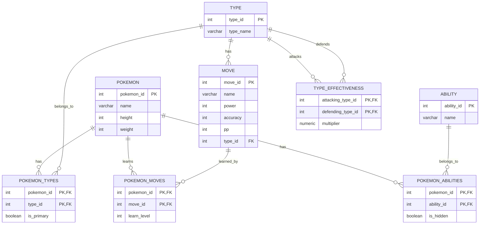

# Database Project HEAU
For ITU BLG317E Database Systems Course by **H**üseyin **E**rtuğrul **A**rif **U**tku

# Entity Relationship Diagram

## Backend

The main purpose of the backend is to be a bridge between frontend and database. It is responsible for handling requests from the frontend, querying the database, and returning the results to the frontend.

The endpoint are as follows:

- `/pokemon/all`:
    - `GET`: Returns all the pokemons in the database.

- `/pokemon/{pokemon_id}`:
    - `GET`: Returns the pokemon with the given id.
    - `POST`: Adds a new pokemon to the database.
    - `PUT`: Updates an existing pokemon in the database.
    - `DELETE`: Deletes an existing pokemon from the database.

- `/pokemon/type/{type_id}`:
    - `GET`: Returns all the pokemons with the given type.

- `/pokemon/move/{move_id}`:
    - `GET`: Returns all the pokemons with the given move.

- `/pokemon/ability/{ability_id}`:
    - `GET`: Returns all the pokemons with the given ability.

- `/pokemon/type-effectiveness/{type_id}`:
    - `GET`: Returns all the type effectivenesses with the given type.

- `/type/all`:
    - `GET`: Returns all the types in the database.

- `/move/all`:
    - `GET`: Returns all the moves in the database.

- `/ability/all`:
    - `GET`: Returns all the abilities in the database.

- `/type-effectiveness/all`:
    - `GET`: Returns all the type effectivenesses in the database.
pokemon_idPKstringnameintbase_hpintbase_attackintbase_defenseintbase_sp_attackintbase_sp_defenseintbase_speedintweightintheightbooleanis_legendarystringdescription
