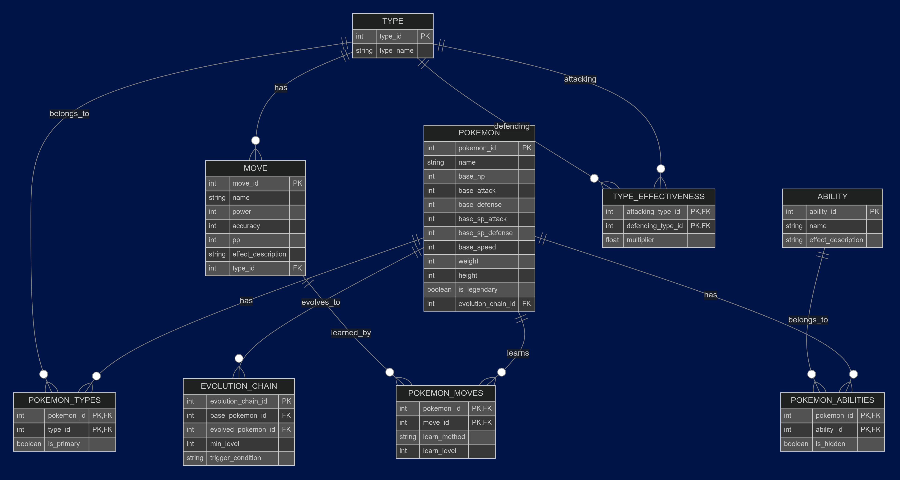

# Database Structure

## Overview

Our database consists of Pokemon data, incluuding information about their height, weight, types, moves and abilities. It is sourced from an open source project, [PokeAPI](https://github.com/PokeAPI/pokeapi).

## Entity Relationship Diagram (ERD)

# Application

The web app is built with the following stack:
- **Frontend:** Vite + React + shadcn
- **Backend:** NestJS
- **Database:** PostgreSQL

### Screenshots
#### Main Page
#### Adding a Pokemon
#### Editing a Pokemon
#### Deleting a Pokemon
#### Searching for a Pokemon

# SQL Queries & CRUD Operations
-- FILL HERE --
