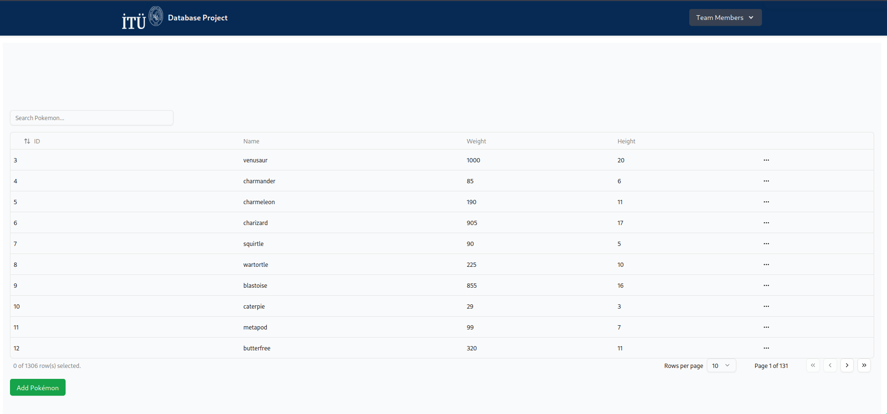
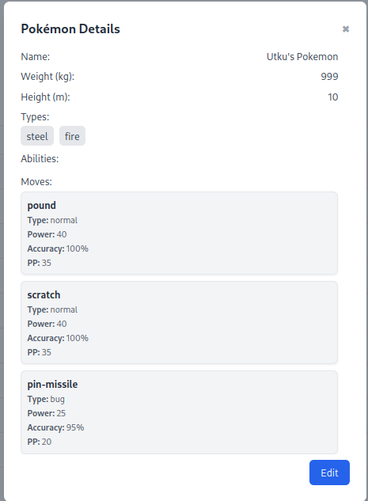
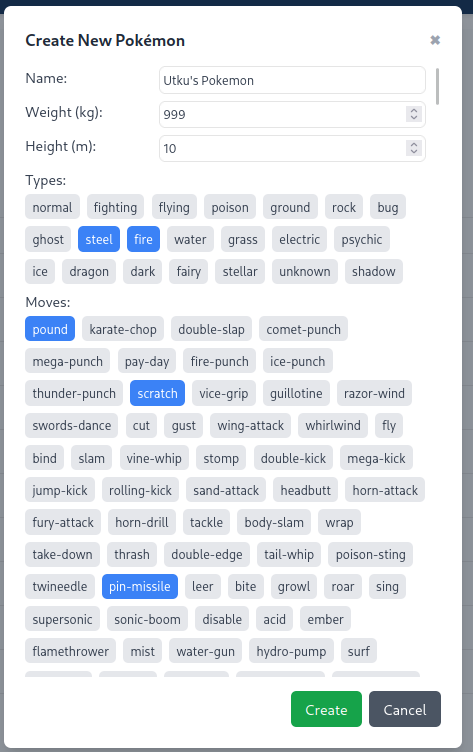
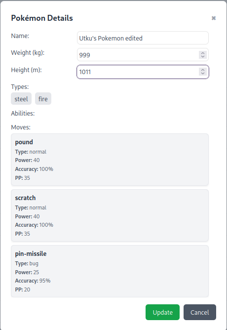
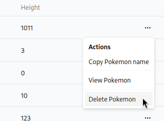
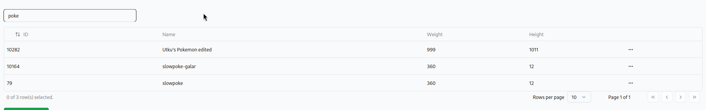

# Database Structure

## Overview

Our database consists of Pokemon data, incluuding information about their height, weight, types, moves and abilities. It is sourced from an open source project, [PokeAPI](https://github.com/PokeAPI/pokeapi).

## Entity Relationship Diagram (ERD)

# Application

The web app is built with the following stack:
- **Frontend:** Vite + React + shadcn
- **Backend:** NestJS
- **Database:** PostgreSQL

### Screenshots
#### Main Page

#### Viewing a Pokemon

#### Adding a Pokemon

#### Editing a Pokemon

#### Deleting a Pokemon

#### Searching for a Pokemon

# SQL Queries & CRUD Operations

### ability/:
  - all                   : returns all rows from the ABILITY table.
    `SELECT * FROM ability;`

  - from_pokemon          : returns the abilities which a specific pokemon has.
    `SELECT ability.ability_id, ability.name
     FROM ability JOIN pokemon_abilities ON ability.ability_id = pokemon_abilities.ability_id
     WHERE pokemon_abilities.pokemon_id = $1;`

  - new                   : creates a new relation in the POKEMON_ABILITY table from the pokemon ID, ability ID and is hidden values.
    `INSERT INTO pokemon_abilities
     VALUES ($1, $2, $3);`

### effectiveness/:
  - all                   : returns all rows from the EFFECTIVENESS table.
    `SELECT * FROM type_effectiveness;`

  - from_attack_type      : returns the effectiveness values of a attacking pokemon type ID.
    `SELECT * FROM type_effectiveness
     WHERE attacking_type_id = $1;`

  - from_attack_type      : returns the effectiveness values of a defending pokemon type ID.
    `SELECT * FROM type_effectiveness
     WHERE defending_type_id = $1;`

### move/:
  - all                   : returns all rows from the MOVE table. Joins the TYPE table to also fetch the type of the move.
    `SELECT move.move_id, move.name, move.power, move.accuracy, move.pp, type.type_id, type.type_name
     FROM move JOIN type ON move.type_id = type.type_id;`

  - from_pokemon          : returns the moves which a specific pokemon has.
    `SELECT type.move_id, type.name
     FROM move JOIN pokemon_moves ON move.move_id = pokemon_moves.move_id
     WHERE pokemon_moves.pokemon_id = $1;`

  - new                   : creates a new relation in the POKEMON_MOVE table from the pokemon ID, move ID and learn level values.
    `INSERT INTO pokemon_moves
     VALUES ($1, $2, $3);`

### pokemon/:
  - all                   : returns all rows from the POKEMON table.
    `SELECT * FROM pokemon;`

  - delete                : deletes a row from the POKEMON table, and all relations that this pokemon has with TYPE, MOVE and ABILITY tables.
    `DELETE FROM pokemon WHERE pokemon_id = $1;
     DELETE FROM pokemon_types WHERE pokemon_id = $1;
     DELETE FROM pokemon_moves WHERE pokemon_id = $1;
     DELETE FROM pokemon_abilities WHERE pokemon_id = $1;`

  - from_ability          : returns the rows from the POKEMON table that has a specific ability which is specified by its ID.
    `SELECT pokemon.pokemon_id, name, height, weight
     FROM pokemon JOIN pokemon_abilities ON pokemon.pokemon_id = pokemon_abilities.pokemon_id
     WHERE pokemon_abilities.ability_id = $1;`

  - from_move             : returns the rows from the POKEMON table that has a specified move which is specified by its ID.
    `SELECT pokemon.pokemon_id, name, height, weight
     FROM pokemon JOIN pokemon_moves ON pokemon.pokemon_id = pokemon_moves.pokemon_id
     WHERE pokemon_moves.move_id = $1;`

  - get                   : returns the row from the POKEMON table which has a specified pokemon ID.
    `SELECT * FROM pokemon
     WHERE pokemon_moves.move_id = $1;`

  - get_max_id            : returns the maximum of the ID values from the POKEMON table which will be used to generate a new and unique ID.
    `SELECT MAX(pokemon_id) FROM pokemon;`

  - new                   : creates a new row in the POKEMONS table from the ID, name, weight and height properties.
    `INSERT INTO pokemon (pokemon_id, name, weight, height)
     VALUES ($1, $2, $3, $4);`

  - update                : updates the weight, height and name properties in the POKEMON table from an ID.
    `UPDATE pokemon SET (name = $2, height = $3, weight = $4)
     WHERE pokemon_id = $1;`

### type/:
  - all                   : returns all rows from the TYPE table rows.
    `SELECT * FROM type;`

  - from_pokemon          : returns the types which a specific pokemon has.
    `SELECT type.type_id, type.type_name
     FROM type JOIN pokemon_types ON type.type_id = pokemon_types.type_id
     WHERE pokemon_types.pokemon_id = $1;`

  - new                   : creates a new relation in the POKEMON_TYPE table from the pokemon ID, type ID and is primary values.
    `INSERT INTO pokemon_types
     VALUES ($1, $2, $3);`
